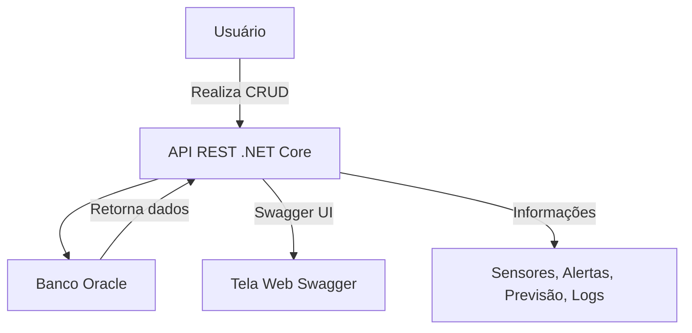

# 🚀 Sistema de Monitoramento Ambiental com .NET + Oracle + Devops

## ✨ Visão Geral

Este projeto tem como objetivo o desenvolvimento de uma API RESTful para o monitoramento ambiental utilizando sensores, com backend em ASP.NET Core, banco de dados Oracle e documentação integrada via Swagger.

O sistema permite o cadastro, leitura e geração de alertas com base nos dados coletados por sensores em tempo real.

---

## 📄 Diagrama da Arquitetura



---

## 🚜 Tecnologias Utilizadas

* ASP.NET Core 7.0
* Oracle Database (XEPDB1)
* Entity Framework Core
* Swagger (Swashbuckle)
* Visual Studio / VS Code
* SQL Developer
* Docker (opcional)

---

## 📁 Estrutura do Projeto

* `Controllers/` → Endpoints da API (Usuarios, Sensores, Alertas, etc.)
* `Models/` → Entidades mapeadas com \[DataAnnotations]
* `Data/AppDbContext.cs` → Contexto do EF Core
* `Program.cs` → Configuração de serviços, Swagger e banco

---

## 📅 Desenvolvimento

### Tabelas Criadas no Oracle

* USUARIOS
* SENSORES
* PREVISAO\_TEMPO
* ALERTA
* LEITURA\_SENSOR
* LOG\_API

### Exemplo de Entidade

```csharp
[Table("USUARIOS")]
public class Usuario
{
    [Key]
    [Column("ID_USUARIO")]
    public int IdUsuario { get; set; }

    [Column("NOME")]
    public string Nome { get; set; } = string.Empty;

    [Column("EMAIL")]
    public string Email { get; set; } = string.Empty;

    [Column("RECEBER_ALERTAS")]
    public string? ReceberAlertas { get; set; }
}
```

---

## ✅ Testes Realizados via Swagger

### Exemplo de Testes CRUD no Endpoint `/api/usuarios`

* `GET /api/usuarios` → Lista todos os usuários
* `POST /api/usuarios` → Cadastra novo usuário

```json
{
  "nome": "João Silva",
  "email": "joao@email.com",
  "receberAlertas": "S"
}
```

* `PUT /api/usuarios/1` → Atualiza dados
* `DELETE /api/usuarios/1` → Remove o usuário

### Outras Rotas Testadas:

* `/api/sensores`
* `/api/alerta`
* `/api/previsaotempo`
* `/api/leituraSensor`
* `/api/logApi`

---

## 🔐 Instruções para Execução

### Requisitos:

* Oracle XE rodando localmente (porta 1521)
* .NET SDK instalado

### 1. Configure a connection string:

Arquivo `appsettings.json`:

```json
"ConnectionStrings": {
  "OracleConnection": "User Id=rm555341;Password=070705;Data Source=oracle.fiap.com.br:1521/orcl;"
}
```

### 2. Execute a aplicação no visual studio ou digite:

```bash
dotnet run
```

### 3. Acesse o Swagger:

```
http://localhost:5232/swagger/index.html
```

---

## 🚀 DevOps e Demonstração em Docker

### ✅ Objetivo

Demonstrar o funcionamento completo da aplicação com containers Docker e persistência de dados, com base em comandos executados e infraestrutura usada para execução do projeto.

### 🔧 Etapas Executadas

#### 1. Clone o repositório .NET:

```bash
https://github.com/Joaopcancian/Zylo
```

#### 2. Entre no terminal no prompt de comando e digite:

```prompt
cd global
```

#### 3. Execução dos containers:

```bash
docker-compose up -d --build
```

#### 4. Acesso via navegador:

```
http://localhost:8080/swagger
```

#### 5. Testar de operações CRUD no Swagger:

* Criar (`POST`)
* Consultar (`GET`)
* Atualizar (`PUT`)
* Excluir (`DELETE`)

---

## 🌟 Conclusão

O sistema foi implementado com sucesso, permitindo a manipulação de dados em tempo real oriundos de sensores ambientais, com persistência no Oracle e operações seguras via API REST. A arquitetura permite escalabilidade e integrações futuras (MQTT, dashboards IoT, etc.).

---

## 🎓 Autores

João Pedro Cancian Corrêa – RM: 555341
Giulia Camillo - RM: 554473
Caroline de Oliveira - RM: 559123

Desenvolvido como parte da Sprint 1 - 3º Semestre

Desenvolvido como parte do desafio prático para sistema de monitoramento com foco em IoT e integração de banco Oracle com .NET.
